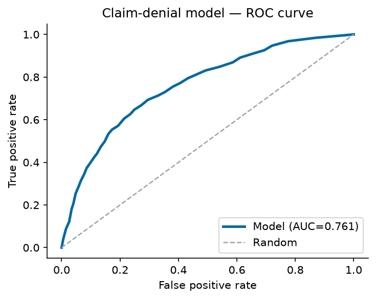
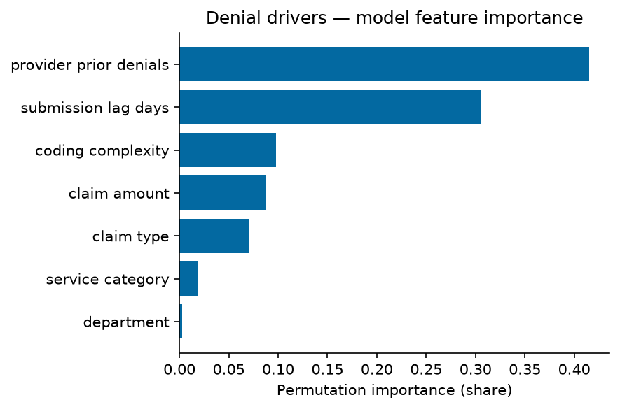
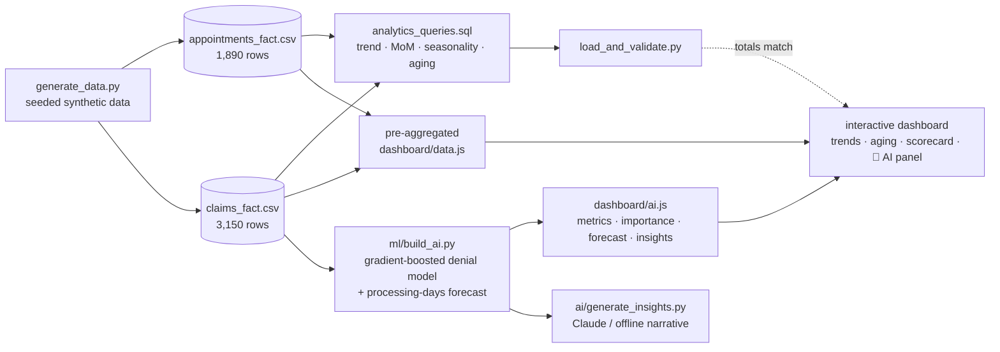

# claims-appointment-trend-analysis 📈

**Where the delays are hiding — appointment demand, cancellation behavior, claims status movement and the aging/processing bottlenecks a hospital operations team needs to see.**

[](https://mohidev-tech.github.io/claims-appointment-trend-analysis/dashboard/)
[](#-ai--predictive-features)
[](#run-it-locally)
[](LICENSE)

> Built to support hospital operations and reporting teams with better visibility into
> **where delays, bottlenecks or unusual trends are occurring** — service demand,
> appointment completion and cancellation patterns, department workload and claims-status
> movement over time.


## What the trend analysis surfaces

| Area | What it shows |
|---|---|
| **Appointment demand** | Volume trend by month, with seasonality |
| **Cancellation behavior** | Completed vs. cancelled vs. no-show over time |
| **Department workload** | Which departments carry the load |
| **Claims status** | Distribution across submitted → in-review → approved / denied / paid |
| **Claims aging** | 0-30 / 31-60 / 61-90 / 90+ day buckets, trended |
| **Processing bottleneck** | Average processing days — rising over the period |

Two signals the data makes obvious:
- **Processing time is drifting up:** 21.9 → 26.7 days across the 18 months — a growing bottleneck.
- **Cancellations are seasonal:** ~20% in Dec–Feb vs. ~13% mid-year.

Filters: **month range · department · service category · claim status**.

## 🤖 AI & predictive features

This project ships a trained ML layer, not just charts — surfaced in the dashboard's **AI & Predictive Analytics** section:

| Feature | What it does | Result |
|---|---|---|
| **Claim-denial model** | Gradient-boosted classifier (scikit-learn) predicting whether a claim is denied from amount, submission lag, provider history, coding complexity, department, claim type & service category | **AUC 0.76**, precision 0.65, recall 0.26 on a held-out 2,250-claim test set (25.2% denial base rate) |
| **Feature importance** | Permutation importance ranks the true denial drivers under a non-linear model | provider prior denials, submission lag & coding complexity lead |
| **Processing-days forecast** | Holt-Winters projection of the claim-count-weighted avg processing days — the bottleneck | 6-month forecast rises **26.7 → 28.5 days** (+6.8%) with a 95% band |
| **Anomaly detection** | z-score scan of month-over-month processing time | steady structural drift, no abrupt spikes |
| **Automated insights** | Plain-language narrative + a recommended action, generated from the model output (Power BI Smart-Narrative style) | see the dashboard's AI panel |
| **GenAI narrative (optional)** | `ai/generate_insights.py` uses the **Claude API** to write the executive summary; falls back to the offline engine when no key is set | `ai/ai_narrative.md` |




```bash
python ml/build_ai.py            # trains the model, writes metrics + figures + dashboard/ai.js
python ai/generate_insights.py   # (optional) LLM/offline executive narrative
```

`data/claims_detail.csv` is a seeded row-level dataset (~9,000 claims, `numpy.default_rng(42)`) generated inside `ml/build_ai.py` to train the denial model — the shipped `claims_fact.csv` is pre-aggregated, so the row-level detail is synthesised for the classifier.

## Data flow



## Metric definitions

| Measure | Definition |
|---|---|
| **Cancellation rate** | cancelled ÷ total appointments |
| **Completion rate** | completed ÷ total appointments |
| **Claim approval rate** | (approved + paid) ÷ total claims |
| **Avg processing days** | claim-count-weighted processing time |
| **% aged 90+** | claims in the 90+ day aging bucket ÷ total claims |
| **Aging buckets** | 0-30 / 31-60 / 61-90 / 90+ days; buckets sum exactly to claim count |

## Screenshots

**All departments:**


**Drill-down — General Surgery (claims aging & processing):**


## Reconciliation (dashboard ↔ SQL)

`python sql/load_and_validate.py`:

```
== KPI SUMMARY (latest month) ==
  month = 2025-06
  total_appointments = 4,389
  cancellation_rate  = 13.44%
  completion_rate    = 79.81%
  total_claims       = 2,067
  approval_rate      = 65.36%
  avg_processing_days= 26.7
  pct_aged_90_plus   = 3.24%
  total_billed       = $2,157,082
```

## Run it locally

```bash
python data/generate_data.py       # (optional) regenerate the seeded data
python sql/load_and_validate.py     # reconcile metrics against SQL
python -m http.server 8791          # then open http://localhost:8791/dashboard/
```

Or open `dashboard/index.html` directly — self-contained, no build or dependencies.

## Repo layout

```
data/
  generate_data.py         seeded generator (SEED=42), seasonality + bottleneck trend
  appointments_fact.csv    month × department × service_category × status
  claims_fact.csv          month × department × claim_type × status (+ aging buckets)
  claims_detail.csv        seeded row-level claims (~9,000) for the denial model (rng=42)
ml/
  ai_lib.py                reusable AI toolkit (classifier, forecast, anomaly, insights)
  build_ai.py              trains the denial model → metrics, figures, dashboard/ai.js
  model_metrics.json       held-out AUC / precision / recall / confusion matrix
  figures/                 ROC curve, feature importance, confusion matrix
ai/
  generate_insights.py     Claude-API narrative with offline fallback
  ai_narrative.md          generated executive narrative
sql/
  analytics_queries.sql    trend / MoM / seasonality / aging SQL
  load_and_validate.py     loads CSVs → SQLite and reconciles
dashboard/
  index.html               the interactive dashboard
  data.js                  pre-aggregated payload (generated)
  assets/                  dependency-free SVG chart library + theme
screenshots/               rendered proof
```

## Part of Adithya's data-analytics portfolio

| Project | Focus |
|---|---|
| [credit-risk-portfolio-analytics](https://github.com/mohidev-tech/credit-risk-portfolio-analytics) | Banking delinquency, charge-off & risk segmentation |
| [healthcare-operations-dashboard](https://github.com/mohidev-tech/healthcare-operations-dashboard) | Patient volume, utilization & claims ops KPIs |
| [customer-segmentation-churn-analysis](https://github.com/mohidev-tech/customer-segmentation-churn-analysis) | Churn drivers, segmentation & retention watchlist |
| **claims-appointment-trend-analysis** ← *you are here* | Claims aging, cancellation & processing bottlenecks |
| [executive-kpi-reporting-automation](https://github.com/mohidev-tech/executive-kpi-reporting-automation) | Automated multi-team KPI reporting + Excel pipeline |

*Skills: SQL aggregation, healthcare operations & claims analytics, trend/seasonality analysis, data cleaning, dashboard design, business communication.*

*All data is synthetic and reproducible (`SEED = 42`). The dashboard is a self-contained web app that renders anywhere, including live on GitHub Pages.*

## License

MIT — see [LICENSE](LICENSE).
